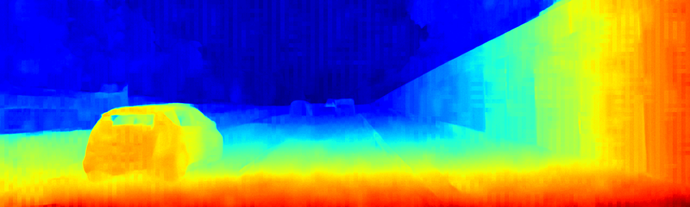
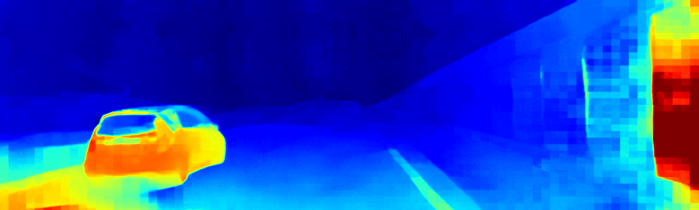
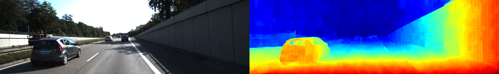

# RAFT-Stereo.axera

RAFT-Stereo 立体匹配深度估计模型在 AXERA NPU 平台上的部署 DEMO

## 支持平台

- [x] AX650N
- [x] AX630C (AX620E)

## 支持语言

- [x] Python
- [x] C++

## 项目结构

```
RAFT-Stereo.axera/
├── python/                    # Python 推理代码
│   ├── infer.py              # AXEngine 推理
│   ├── infer_onnx.py         # ONNX Runtime 推理
│   └── examples/             # 示例图片
├── cpp/                       # C++ 推理代码
│   ├── src/                  # 源代码
│   ├── include/              # 头文件
│   ├── toolchains/           # 交叉编译工具链配置
│   ├── CMakeLists.txt        # CMake 配置
│   ├── build650.sh           # AX650 编译脚本
│   └── build630c.sh          # AX630C 编译脚本
├── model_convert/            # AX650 模型转换
├── model_convert_ax630c/     # AX630C 模型转换
└── README.md
```

## 模型下载

预编译模型下载 [models](https://github.com/AXERA-TECH/RAFT-Stereo.axera/releases/download/v1.0.0/models.tar.gz)
或者[hugging](https://huggingface.co/AXERA-TECH/RAFT-stereo)

如需自行转换请参考：
- AX650: [模型转换](./model_convert/README.md)
- AX630C: [模型转换](./model_convert_ax630c/README.md)

## Python API 运行

### 环境准备

```bash
mkdir /opt/site-packages
cd python
pip3 install -r requirements.txt --prefix=/opt/site-packages
``` 

### 添加环境变量

将以下两行添加到 `/root/.bashrc`(实际添加的路径需要自行检查)后，重新连接终端或者执行 `source ~/.bashrc`

```bash
export PYTHONPATH=$PYTHONPATH:/opt/site-packages/local/lib/python3.10/dist-packages  
export PATH=$PATH:/opt/site-packages/local/bin
``` 

### 基于 ONNX Runtime 运行

可在开发板或PC运行：

```bash
cd python
python3 infer_onnx.py --left examples/left/000051_11.png --right examples/right/000051_11.png --model ../models/raft_steoro384x1280_r4.onnx
```
输出结果：  


或：

```bash
python3 infer_onnx.py --left examples/left/000051_11.png --right examples/right/000051_11.png --model ../models/raft_steoro256x640_r1.onnx
```
输出结果:  


运行参数说明:  
| 参数名称 | 说明  |
| --- | --- | 
| --left | 输入左目图片路径 |  
| --right | 输入左目图片路径 |  
| --model | onnx模型路径 | 

### 基于 AXEngine 运行

在开发板上运行：

```bash
cd python  
python3 infer.py --left examples/left/000051_11.png --right examples/right/000051_11.png \
    --model ../models/raft_steoro384x1280_r4.axmodel --width 1280 --height 384
```
输出结果:  


或：

```bash
python3 infer.py --left examples/left/000051_11.png --right examples/right/000051_11.png \
    --model ../models/raft_steoro256x640_r1.axmodel --width 640 --height 256
```
输出结果:  


运行参数说明:  
| 参数名称 | 说明  |
| --- | --- | 
| --left | 输入左目图片路径 |  
| --right | 输入左目图片路径 |  
| --model | axmodel模型路径 | 
| --width | 输入模型的图片宽度，注意不是图片原始宽度 |  
| --height| 输入模型的图片高度，注意不是图片原始宽度 |


## C++ API 运行

### 编译环境要求

- x86_64 Linux 主机 (Ubuntu 18.04/20.04/22.04)
- CMake >= 3.13
- wget, unzip, tar, git, make

构建脚本会自动下载以下依赖：
- 交叉编译工具链 (gcc-arm-9.2-2019.12-x86_64-aarch64-none-linux-gnu)
- OpenCV 预编译库 (aarch64)
- BSP SDK (ax650n_bsp_sdk 或 ax620e_bsp_sdk)

### 编译

在 x86_64 Linux 主机上进行交叉编译：

**AX650N:**

```bash
cd cpp
./build650.sh
```

**AX630C (AX620E):**

```bash
cd cpp
./build630c.sh
```

首次编译会下载依赖（约 500MB），后续编译会复用已下载的文件。

编译完成后，可执行文件位于：
- AX650: `cpp/build_ax650/raft_stereo_inference`
- AX630C: `cpp/build_ax630c/raft_stereo_inference`

### 上板部署

1. 将可执行文件拷贝到开发板：

```bash
scp cpp/build_ax650/raft_stereo_inference root@<开发板IP>:/root/
```

2. 将模型和测试图片拷贝到开发板：

```bash
scp models/raft_steoro384x1280_r4.axmodel root@<开发板IP>:/root/
scp python/examples/left/000051_11.png root@<开发板IP>:/root/left.png
scp python/examples/right/000051_11.png root@<开发板IP>:/root/right.png
```

### 上板运行

```bash
./raft_stereo_inference -m raft_steoro384x1280_r4.axmodel \
    -l left.png -R right.png -g 384,1280 -r 10
```

### 运行示例

```
root@ax650:~/ax650# ./raft_stereo_inference -m ax650/raft_steoro384x1280_r4.axmodel -l examples/left/000051_11.png -R ex
amples/right/000051_11.png -g 384,1280 -r 10
--------------------------------------
model file : ax650/raft_steoro384x1280_r4.axmodel
left image file : examples/left/000051_11.png
right image file : examples/right/000051_11.png
img_h, img_w : 384 1280
--------------------------------------
Engine creating handle is done.
Engine creating context is done.
Engine get io info is done.

input size: 2
  [0] x1 [UINT8] 1 x 384 x 1280 x 3
  [1] x2 [UINT8] 1 x 384 x 1280 x 3

output size: 1
  [0] output [FLOAT32] 1 x 1 x 384 x 1280
Engine alloc io is done.
Left input index: 0, Right input index: 1
Engine push input is done.
--------------------------------------
Warming up...
Running inference...
post process cost time:9.66 ms
--------------------------------------
Repeat 10 times, avg time 111.86 ms, max_time 112.01 ms, min_time 111.74 ms
Disparity range: [0.01, 70.74]
--------------------------------------
Saved disparity map: raft_stereo_disparity.png
Saved combined result: raft_stereo_result.png
--------------------------------------
```

输出结果:  


### C++ 运行参数说明

| 参数 | 说明 |
| --- | --- |
| -m, --model | axmodel 模型文件路径 |
| -l, --left | 左目图片路径 |
| -R, --right | 右目图片路径 |
| -g, --size | 输入尺寸 (height,width), 默认: 384,1280 |
| -r, --repeat | 重复推理次数 (用于性能测试), 默认: 1 |

### 输出文件

- `raft_stereo_disparity.png`: 深度/视差图可视化 (JET colormap)
- `raft_stereo_result.png`: 左图和深度图并排对比

## Latency

### AX650N

| model | latency(ms) |
|---|---|
| raft_steoro256x640_r1.axmodel | 20.9 |
| raft_steoro384x1280_r4.axmodel | 111.8 |

### AX630C

| model | latency(ms) |
|---|---|
| raft_steoro256x640_r1_npu2.axmodel | 317.765 |
| raft_steoro256x640_r4_npu2.axmodel | 825.793 |

## 技术讨论

- Github issues
- QQ 群: 139953715
